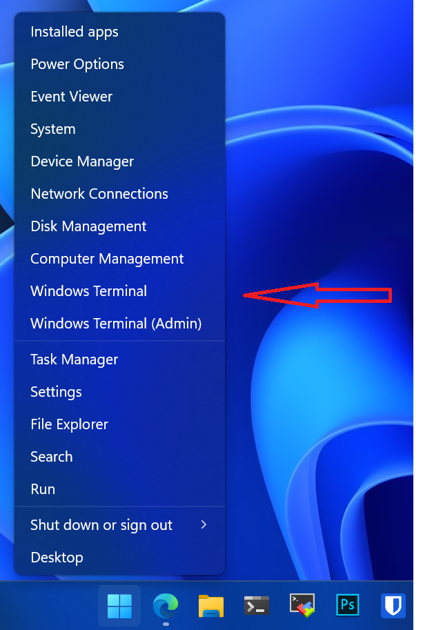
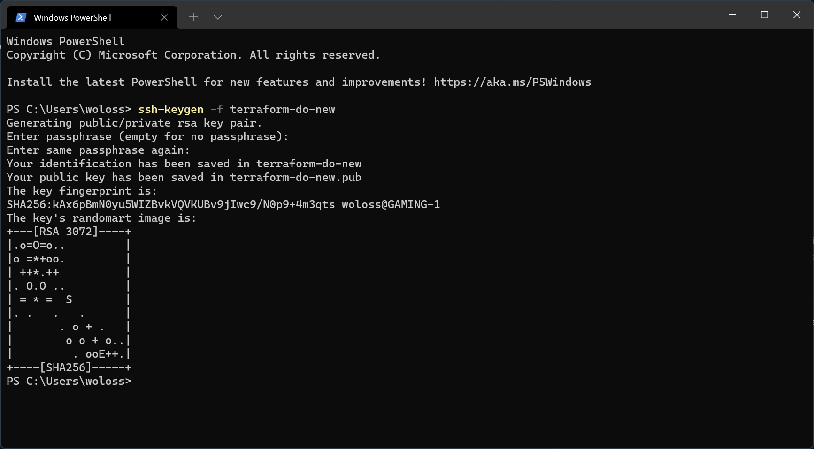
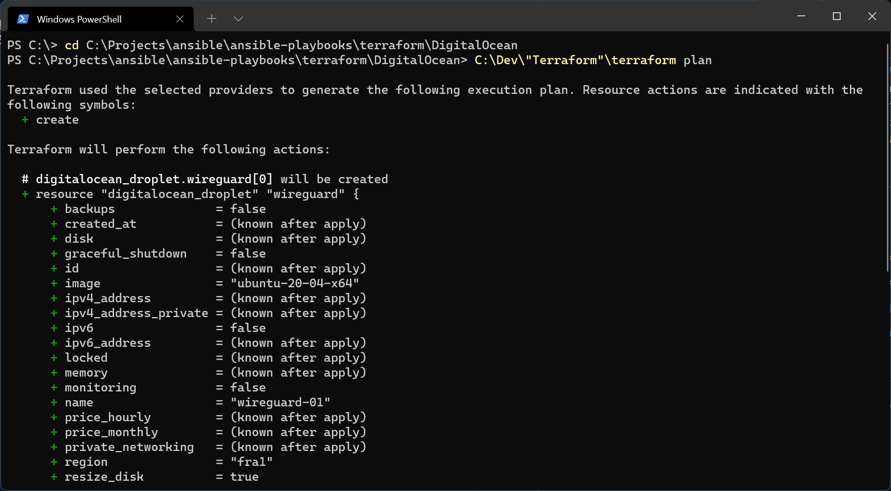

# Steps to reproduce:
1. Download terraform - https://www.terraform.io/downloads
2. Download wireguard - https://www.wireguard.com/install/
3. Register account at - https://www.digitalocean.com/
4. Open Powershell.exe/CMD/WindowsTerminal
<div align="center">

</div>

5. Create private key  ```ssh-keygen -f terraform-do```


<div align="center"></div>

*or https://docs.digitalocean.com/products/droplets/how-to/add-ssh-keys/create-with-putty/*  

6. https://cloud.digitalocean.com/account/security - add content of public part of your ssh key ```terraform-do.pub```  
7. Copy SSH Fingerprint from same Web page to terraform.tfvars under ```ssh_key_fingerprint="<SSH_FINGERPRINT>"```  
8. Create DO Token - https://cloud.digitalocean.com/account/api/tokens  
9. Copy DO Token to terraform.tfvars under ```do_token="<TOKEN>"```  
10. Insert your username to terraform.tfvars under ```pvt_key="<PATH_TO_KEY>"```

# Finale:
1. Open Powershell/CMD/WindowsTerminal once again.
2. type ```cd "<PATH_WHERE_THIS_REPO_FILES_Located>"```
2. type ```C:\"<PATH_WHERE_TERRAFORM_Located>"\terraform.exe init```
3. type ```C:\"<PATH_WHERE_TERRAFORM_Located>"\terraform.exe apply```
<div align="center"></div>

5. Upon success you can find out generated config for wireguard in ```client-01.conf```


# Advanced
## Provision multiple Droplets manually via ansible
1. ```terraform apply -var "use_local_ansible=false" -var "amount_of_vms=2"```
2. ```ansible-playbook wireguard.yml -i inventory```